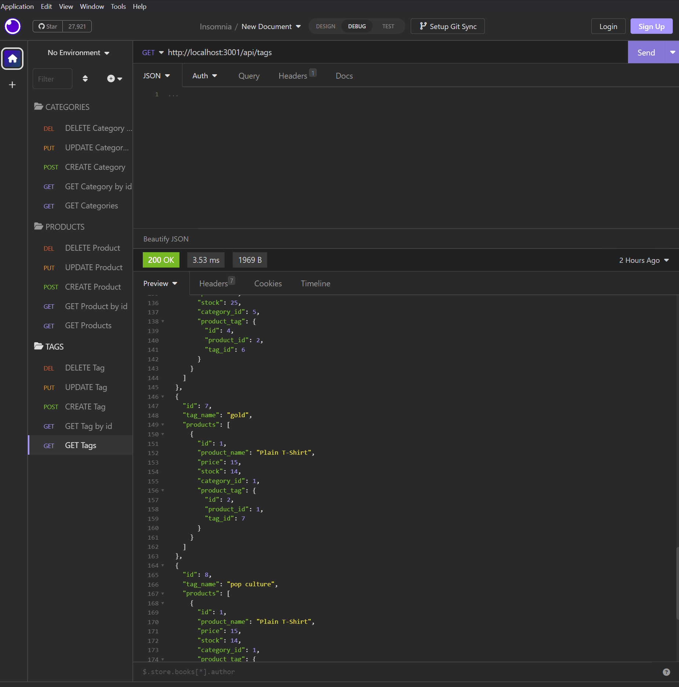

# E-Commerce Back-end
  

  ## Description
  This application is a back-end environement for an e-commerce site. We were given the starter code and had to implement models, associations, and routes in order for the application to function. The motivation for this project was to implement newly learned MySQL, Sequelize, and Express.js techniques. There is no front-end to this application so it is only functional within a server environment like Insomnia.

  ## Table of Contents
  * [Installation](#installation)
  * [Usage](#usage)
  * [License](#license)
  * [Credits](#credits)

  ## Installation
  To install dependencies, use the command `npm i`.
  
  ## Usage
  To start this application, create the database inside mySQL using `source schema.sql`. Then seed the database by running `npm run seed` in the root directory terminal. Then run `npm start` to initialize the server. The GET, POST, PUT and DELETE routes can be tested within Insomnia.
  

  Walkthough Video: https://drive.google.com/file/d/1fTl5d_XbKBG77-X78ABvls8QIQ_pDdUh/view

## License

This project is licensed under the [MIT](https://opensource.org/licenses/MIT) license.

## Credits
https://sequelize.org/docs/v6/getting-started/ 
https://sequelize.org/docs/v6/core-concepts/assocs/ 
https://expressjs.com/en/guide/routing.html 
https://docs.insomnia.rest/insomnia/send-your-first-request 
